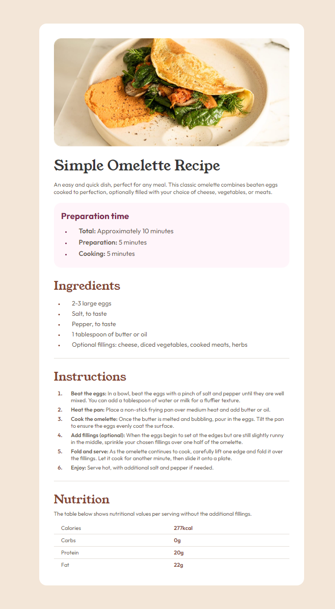

# Frontend Mentor - Recipe page solution

This is a solution to the [Recipe page challenge on Frontend Mentor](https://www.frontendmentor.io/challenges/recipe-page-KiTsR8QQKm). Frontend Mentor challenges help you improve your coding skills by building realistic projects.

## Table of contents

- [Overview](#overview)
  - [The challenge](#the-challenge)
  - [Screenshot](#screenshot)
  - [Links](#links)
- [My process](#my-process)
  - [Built with](#built-with)
  - [What I learned](#what-i-learned)
  - [Continued development](#continued-development)
- [Author](#author)

## Overview

### Screenshot



### Links

- Solution URL: [Solution URL](https://github.com/TrEv0rRrRr/Recipe-page)
- Live Site URL: [Live site URL](https://trev0rrrrr.github.io/Recipe-page/)

## My process

### Built with

- Semantic HTML5 markup
- CSS custom properties
- Flexbox
- CSS Grid

### What I learned

Use this section to recap over some of your major learnings while working through this project. Writing these out and providing code samples of areas you want to highlight is a great way to reinforce your own knowledge.

To see how you can add code snippets, see below:

```html
<div class="section__table" role="grid" aria-label="Nutritional Information">
  <div class="table-headers" role="rowgroup">
    <p role="row">Calories</p>
    <p role="row">Carbs</p>
    <p role="row">Protein</p>
    <p role="row">Fat</p>
  </div>
  <div class="table-data" role="rowgroup">
    <p role="row">277kcal</p>
    <p role="row">0g</p>
    <p role="row">20g</p>
    <p role="row">22g</p>
  </div>
</div>
```

```css
.section__p-nutrition {
  font-size: 0.7rem;
  margin-top: 5px;
  margin-bottom: 10px;
}

.section__table {
  display: grid;
  grid-template-columns: repeat(2, 50%);
}

.table-headers p,
.table-data p {
  border-bottom: 1px solid var(--Stone-150);
  padding: 5px;
  font-size: 0.7rem;
}

.table-headers p:last-child,
.table-data p:last-child {
  border-bottom: none;
}

.main__section-attribution {
  display: none;
}

.table-headers p {
  padding-left: 15px;
  font-weight: var(--w-400);
}

.table-data p {
  font-weight: var(--w-600);
}
```

### Continued development

Finally I used grid to make something, in this case a table to show data about the nutrition values. I hope to continue using and learning about this way of modeling.

## Author

- Frontend Mentor - [@TrEv0rRrRr](https://www.frontendmentor.io/profile/TrEv0rRrRr)
